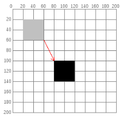

# Lista 1

* OBS:
  * Variável D = seu dia de nascimento 
  * Variável M = seu mês de nascimento

# Anotações

* Pipepline Fixo: renderização dependente de algoritmos, sem liberdade para customização ou substituição de algoritmos.
* Pipelineline Programável: inclusão de shaders, ou seja, etapas, programáveis de vértices e fragmentos.
* Primitivas Geométricas: Elementos gráficos simples que formam objetos complexos quando combinados. (Exemplos: Linhas, Triângulos, Cores, ...)
* Transformações Geométricas: São operações aplicadas aos vértices dos objetos, ou seja, na descrição geométrica dos objetos:
  * Primárias: Translação, Escala e Rotação
  * Secundárias: Reflexão, Cilhamento
* Ordem das transformações: Sua ordem importa, e sua matriz de transformação final é dada pela primeiro transformação mais a direita e a última a esquerda.
* Clipping: Cortar objetos, é mais complexo pois exige a criação de novos triângulos.
* Culling: Não renderizar objetos, é fácil pois não precisa fazer alterações. 

# Exercícios

1. **Qual a diferença entre Processamento de Imagens, Visão Computacional e 
Síntese de Imagens?**
    A diferença entre estes tópicos é relativo ao seus objetivos:
    
    * Processamento de Imagens: Possui o objetivo de melhorar as características visuais (reduzindo ruídos, aumentando brilho e eliminando distorções). Além de extrair elementos de interesse de imagens.
    * Visão Computacional: Possui o objetivo de atribuir sentido na visão da máquina, como por exemplo detecção de objetos, reconhecimento de padrões, ...
    * Computação Gráfica: Possui o objetivo na síntese de imagens (modelagem e renderização), ou seja, o mundo 3D dentro de um ambiente computacional.

2. **O que é e por qual motivo utilizar coordenada homogênea para especificar 
transformações geométricas em CG?**    
    Coordenadas homogêneas facilitam a aplicação de transformações geométricas (rotação, escala, translação) através de multiplicações de matrizes, unificando essas operações em uma única fórmula. Elas permitem a composição eficiente de várias transformações e são essenciais para projeções 3D. Isso simplifica a computação gráfica e melhora o desempenho.

3. **Apresente  a  matriz  que  representa  uma  transformação  geométrica 
consistindo de uma translação seguida de uma rotação.**
    Iremos considerar T como a matriz de translação e R como a de rotação. Então a matriz da transformação final ficaria $M = R \cdot T$

    $$
      \begin{bmatrix}
        \cos(\theta) & -\sin(\theta) & \cos(\theta) \cdot x - \sin(\theta) \cdot y \\
        \sin(\theta) & \cos(\theta)  & \sin(\theta) \cdot x + \cos(\theta) \cdot y \\
        0            & 0             & 1
      \end{bmatrix}
    $$

4. **Apresente a matriz que representa uma transformação consistindo de uma 
translação tx=M e ty=D seguida de uma escala uniforme s=2. Qual o impacto 
dessa transformação para objetos definidos em relação à origem e para 
objetos fora da origem?** 

    Iremos ter o seguinte matriz de transformação final $M = S \cdot T$.
    $$
      \begin{bmatrix}
        2 & 0 & 0 \\
        0 & 2 & 0 \\
        0 & 0 & 1 
      \end{bmatrix}

      \cdot 

      \begin{bmatrix}
        1 & 0 & 4 \\
        0 & 1 & 27 \\
        0 & 0 & 1 
      \end{bmatrix}

      =

      \begin{bmatrix}
        2 & 0 & 8 \\
        0 & 2 & 54 \\
        0 & 0 & 1 
      \end{bmatrix}
    $$

     1. Objetos na origem (0, 0):
        * **Escala**: A escala aumenta ou diminui o tamanho do objeto, multiplicando suas coordenadas. Mesmo que o objeto esteja na origem, a escala afeta sua geometria. Se o objeto tem algum comprimento ou volume, será aumentado em um fator de 22 em todas as direções. Para um ponto exato na origem, a escala não teria impacto porque a multiplicação por qualquer fator de ainda resulta em 00.
        * **Translação**: A translação move objetos em uma determinada direção (horizontal e/ou vertical). No entanto, se o objeto estiver na origem (coordenada (0,0)(0,0)), a translação não terá impacto. Isso ocorre porque, ao adicionar 44 unidades no eixo xx e 2727 no eixo yy a um ponto na origem, ele continua na posição (0,0)(0,0) em termos de movimento de sua geometria (o ponto de origem em si permanece no mesmo local).

      2. Objetos fora da origem:
          * **Escala**: Quando um objeto está fora da origem, a escala vai modificar todas as coordenadas do objeto proporcionalmente. Se a escala é 22, isso significa que todas as coordenadas (x,y)(x,y) do objeto serão multiplicadas por 22, dobrando o tamanho do objeto em ambas as direções. Por exemplo, um ponto no espaço com coordenadas (x,y)=(3,5)(x,y)=(3,5) será redimensionado para (6,10)(6,10), ou seja, ficará duas vezes mais distante da origem.
          * **Translação**: Após a escala, a translação será aplicada. Isso desloca o objeto em relação ao seu novo tamanho. Nesse caso, após redimensionar o objeto, ele será movido 44 unidades para a direita no eixo xx e 2727 unidades para cima no eixo yy. Por exemplo, se um objeto estava originalmente em (3,5)(3,5), ele será escalado para (6,10)(6,10) e, em seguida, transladado para (6+4,10+27)=(10,37)(6+4,10+27)=(10,37).
          * 
5. **Verifique se $R(M+D)$ irá obter a mesma matriz de transformação do que $R(M) \cdot R(D)$.**

    $$
    R(31) = 
      \begin{bmatrix}
        cos(31) & -sen(31) & 0 \\
        sen(31) & cos(31) & 0 \\
        0 & 0 & 1 
      \end{bmatrix}
      =
      \begin{bmatrix}
        0.8571673 & -0.51503807 & 0 \\
        0.51503807 & 0.8571673 & 0 \\
        0 & 0 & 1 
      \end{bmatrix}
    $$

    $$
      R(27) * R (4) = 
      \begin{bmatrix}
        cos(27) & -sen(27) & 0 \\
        sen(27) & cos(27) & 0 \\
        0 & 0 & 1 
      \end{bmatrix}
      \cdot
      \begin{bmatrix}
        cos(4) & -sen(4) & 0 \\
        sen(4) & cos(4) & 0 \\
        0 & 0 & 1 
      \end{bmatrix}
          =
      \begin{bmatrix}
        0.8571673 & -0.51503807 & 0 \\
        0.51503807 & 0.8571673 & 0 \\
        0 & 0 & 1 
      \end{bmatrix}
    $$

    Ou seja, são a mesma coisa.

6. **Forneça a matriz de transformação que realiza a transformação abaixo (a 
seta indica o objeto inicial e o final após a transformação). Em seguida, 
apresente as coordenadas do objeto para uma escala uniforme s=M.** 

    

    A matriz de transformação $M$, seria:
    $$
    M = 
      \begin{bmatrix}
        1 & 0 & 60 \\
        0 & 1 & 80 \\
        0 & 0 & 1 
      \end{bmatrix}
    $$

    As coordenadas após a escala seriam:
      * $(80, 80, 0)$ 
      * $(240, 80, 0)$
      * $(240, 240, 0)$
      * $(80, 240, 0)$

7. **Mostre  que  a  ordem  das  transformações  pode  modificar  a  matriz  de 
transformação resultante (problema da comutatividade). OBS: É suficiente 
fornecer um exemplo.**
    Iremos considerar duas matrizes:
    $$
      S = 
        \begin{bmatrix}
          2 & 0 & 0 \\
          0 & 2 & 0 \\
          0 & 0 & 1 
        \end{bmatrix}
      T = 
        \begin{bmatrix}
          1 & 0 & -1 \\
          0 & 1 & 1 \\
          0 & 0 & 1 
        \end{bmatrix}
    $$
    $$ 
        \begin{bmatrix}
          2 & 0 & 0 \\
          0 & 2 & 0 \\
          0 & 0 & 1 
        \end{bmatrix}

        \cdot

        \begin{bmatrix}
          1 & 0 & -1 \\
          0 & 1 & 1 \\
          0 & 0 & 1 
        \end{bmatrix}

        =
        \begin{bmatrix}
          2 & 0 & -2 \\
          0 & 2 & 2 \\
          0 & 0 & 1 
        \end{bmatrix}

    $$
    $$ 

        \begin{bmatrix}
          1 & 0 & -1 \\
          0 & 1 & 1 \\
          0 & 0 & 1 
        \end{bmatrix}
        \cdot
        \begin{bmatrix}
          2 & 0 & 0 \\
          0 & 2 & 0 \\
          0 & 0 & 1 
        \end{bmatrix}
        =
        \begin{bmatrix}
          2 & 0 & -1 \\
          0 & 2 & 2 \\
          0 & 0 & 1 
        \end{bmatrix}

    $$

    Assim considerando as matrizes $S$ e $T$, temos resutlados diferentes quando fazemos $S \cdot T$ e $T \cdot S$.

8. **As transformações de rotação e escala são comutativas entre si? Leve em 
conta tanto escalas uniformes quanto não uniformes.**
    
    Transformações de rotação e escala uniforme são comutativas; a ordem de aplicação não altera o resultado final. No entanto, transformações de rotação e escala não uniforme não são comutativas; a ordem de aplicação influencia o resultado. A escala uniforme altera apenas a magnitude, enquanto a escala não uniforme modifica as direções dos vetores, afetando a rotação subsequente. Portanto, a ordem de aplicar uma escala não uniforme e uma rotação importa.

9. **As transformações de translação e escala são comutativas entre si? E entre 
translação e rotação?**

    Translação e escala não são comutativas; a ordem de aplicação altera o resultado final. Da mesma forma, translação e rotação também não são comutativas; a ordem influencia o resultado. Isso ocorre porque translação modifica a posição dos pontos, enquanto escala e rotação alteram suas magnitudes e orientações, respectivamente. Portanto, aplicar uma transformação antes da outra resulta em efeitos diferentes.

10. **Forneça a sequência de transformações que leva o triângulo T1 ao triângulo 
T2 e dê a matriz resultante. É suficiente mostrar as matrizes que compõem a 
matriz resultante explicando o que é cada matriz e seus componentes.**
    
    

    Como visto no execício 8 escala e rotação são comutativas, então não importa a ordem da nossas matrizes: ($c = \cos \theta$ e $s = \cos \theta$)

      $$ 
        \begin{bmatrix}
          c & -s & 0 \\
          s &  c & 0 \\
          0 &  0 & 1 
        \end{bmatrix}
        \cdot
        \begin{bmatrix}
          1 & 0 & x \\
          0 & 1 & y \\
          0 & 0 & 1 
        \end{bmatrix}
        =
        \begin{bmatrix}
          c & -s & cx - sy \\
          s &  c & sx + cy \\
          0 &  0 & 1 
        \end{bmatrix}
      $$

      Agora multiplicando a matriz resultante pelo ponto de origem e destino, teremos as esqueções: $(8, 6) \rightarrow (0, 4)$ e $(5, 2) \rightarrow (4, 1)$
      
      $$
        \begin{align*}
         0&=8c-6s+cx-sy, \\
         4&=6c+8s+sx+cy, \\
         4&=5c-2c-cx-sy, \\
         1&=2c-5s+sx+cy
        \end{align*}
      $$

      A solução do sistema é:
      $$
        s= 0.091, c=0.4541, x=-6.302, y=2.4676
      $$

11. **Dado um vértice/ponto posicionado em x=D e y=M, apresente as matrizes de 
transformação para (1) espelhar esse vértice em relação ao eixo X e (2) 
espelhar esse vértice em relação ao eixo Y.**
      $$
       Rf_{x}(\theta) =
       \begin{bmatrix}
       -1 &  0 & 0 \\
        0 &  1 & 0 \\
        0 &  0 & 1
       \end{bmatrix}
      $$

      Assim, temos que a resolução do sistema é $x=-54$ e $y=0$

      $$
       Rf_{y}(\theta) =
       \begin{bmatrix}
        1 &   0 & 0 \\
        0 &  -1 & 0 \\
        0 &   0 & 1
       \end{bmatrix}
      $$

      Assim, temos que a resolução do sistema é $x=0$ e $y=-8$

12.  **Diferencie as matrizes de rotação 3D de acordo com o eixo de rotação. Por 
que a rotação 3D é mais complexa que a 2D?**

      As matrizes de rotação 3D diferem dependendo do eixo em torno do qual a rotação ocorre. Aqui estão as três principais matrizes de rotação para os eixos X, Y e Z:

        1. **Matriz de rotação em torno do eixo X**:  
        rotação ocorre no plano YZ, com a seguinte forma:

        $$
          R_x(\theta) =
          \begin{bmatrix}
          1 & 0 & 0 \\
          0 & \cos(\theta) & -\sin(\theta) \\
          0 & \sin(\theta) & \cos(\theta)
          \end{bmatrix}
        $$

        2. **Matriz de rotação em torno do eixo Y**:  
        A rotação ocorre no plano XZ, com a forma:

            $$
            R_y(\theta) =
            \begin{bmatrix}
            \cos(\theta) & 0 & \sin(\theta) \\
            0 & 1 & 0 \\
            -\sin(\theta) & 0 & \cos(\theta)
            \end{bmatrix}
            $$

        3. **Matriz de rotação em torno do eixo Z**:  
            A rotação ocorre no plano XY, semelhante à rotação 2D:

            $$
            R_z(\theta) =
            \begin{bmatrix}
            \cos(\theta) & -\sin(\theta) & 0 \\
            \sin(\theta) & \cos(\theta) & 0 \\
            0 & 0 & 1
            \end{bmatrix}
            $$

      Por que a rotação 3D é mais complexa que a 2D?

        - **Número de eixos**: Em 2D, há apenas um eixo de rotação (o eixo Z que sai da tela), enquanto em 3D, há três eixos (X, Y, Z), permitindo rotações em planos diferentes.
      
        - **Ordem de rotação**: No espaço 3D, a ordem na qual as rotações ocorrem é importante devido à **não comutatividade** das matrizes de rotação 3D. Rotacionar em torno de X e depois Y produz um resultado diferente de rotacionar primeiro em Y e depois em X.

        - **Grau de liberdade**: Em 2D, há apenas um grau de liberdade para a rotação (ângulo em torno de um único eixo), mas em 3D há três graus de liberdade, cada um representando uma rotação ao redor de um eixo diferente.

        Essas características tornam a rotação 3D mais complexa e exigem maior atenção à sequência de operações para obter o resultado correto.

      **OBS**: A rotação ao redor de um eixo mantém os pontos ao longo dele inalterados.

13.  **Uma rotação 3D em torno do eixo A = x, y ou z mantém ou altera o valor da 
coordenada A dos vértices do objeto? Por que isso ocorre?**

      Como mencionado ana observação acima, a rotação 3D mantém os pontos inalterados ao redor do eixo de rotação.

14.  **Explique, com suas palavras, o mapeamento 2D de uma imagem de textura 
para um objeto 3D. Descreva ao menos três tipos de mapeamento.**

      O mapeamento 2D de uma imagem de textura para um objeto 3D consiste em "envelopar" a superfície de um modelo tridimensional com uma imagem plana (a textura). A ideia é associar as coordenadas da textura 2D (u, v) às coordenadas do objeto 3D (x, y, z), permitindo que a imagem seja projetada corretamente na geometria do objeto, criando a ilusão de detalhes complexos como cor, padrões ou materiais.
    
      Quatro tipos comuns de mapeamento de textura:

        1. **Mapeamento UV (UV Mapping)**: O método mais comum de mapeamento. O objeto 3D é "desdobrado" em uma malha plana (como abrir um cubo de papelão) e cada ponto da malha é associado a uma coordenada na imagem 2D (chamada de coordenada UV). As coordenadas UV correspondem a pontos da textura que são aplicados na superfície do objeto. Esse método oferece controle preciso sobre a aplicação da textura e funciona bem para objetos com geometrias complexas.

        2. **Mapeamento Esférico (Spherical Mapping)**: Envolve projetar a textura ao redor de um objeto usando coordenadas polares, como se a textura estivesse sendo projetada de dentro de uma esfera ao redor do objeto. Esse método é adequado para objetos com formas esféricas ou curvas, como planetas ou cabeças humanas, mas pode causar distorções próximas aos polos.

        3. **Mapeamento Cilíndrico (Cylindrical Mapping)**: No mapeamento cilíndrico, a textura é envolvida ao redor do objeto como se estivesse enrolada em torno de um cilindro. Este método é ideal para objetos cilíndricos, como garrafas, troncos ou colunas. Porém, pode causar distorções nas extremidades superior e inferior, onde a superfície diverge de uma forma cilíndrica.

        4. **Mapeamento Planar (Planar Mapping)**: O mapeamento planar projeta a textura em um objeto como se a textura fosse aplicada sobre ele de um único plano. Esse método é útil para superfícies planas ou quase planas, como paredes ou terrenos. Ele funciona como se a textura fosse uma folha sendo "colada" diretamente na superfície. Embora seja simples de aplicar, pode resultar em distorções quando usado em objetos curvos, pois a textura não envolve o objeto completamente.

15. **Explique a relação entre pixel e texel.** 

    A relação entre pixel e texel é a seguinte:

    * **Pixel** é a menor unidade de uma imagem 2D exibida na tela.
    * **Texel** é a menor unidade de uma textura 2D usada em gráficos 3D.

    Quando uma textura é aplicada a um objeto 3D, os texels são convertidos em pixels na tela. O número de pixels que um texel cobre depende da proximidade do objeto à câmera: objetos próximos mostram mais detalhes, enquanto objetos distantes têm menos detalhes visíveis devido à redução de texels por pixel.

16.   **Na parametrização de texturas, explique a diferença entre os parâmetros 
REPEAT e CLAMP.**

      * **REPEAT**: repete a textura indefinidamente além dos limites de 0 a 1. Isso é útil quando se deseja criar padrões contínuos e repetitivos, como pisos, paredes ou grades.
      * **CLAMP**: estica o último texel nas bordas da textura quando as coordenadas excedem 0 ou 1, sem repetir. Isso é útil para evitar artefatos ou costuras nas bordas de objetos onde a textura deve parar exatamente, como ao mapear uma única imagem em uma superfície.

17.   **Durante o mapeamento de pixels e texels, qual a diferença entre as técnicas 
LINEAR e NEAREST?**
    
      * NEAREST: usa o texel mais próximo, resultando em bordas nítidas e aparência "pixelada". Não faz qualquer tipo de suavização, resultando em uma aparência mais nítida, mas com bordas "duras" ou "pixeladas".
      * LINEAR: usa interpolação entre texels vizinhos para suavizar a transição, criando uma aparência mais fluida e natural. Isso resulta em uma textura mais suave e fluida, especialmente quando há ampliação ou redução de uma imagem. As transições entre os texels são mais gradativas, eliminando bordas "duras".

18.   **As matrizes Model, View e Projection utilizam transformações geométricas 
3D para compor as coordenadas de mundo, visão e clip. Esse processo 
também é chamado de pipeline do Viewing 3D. Escreva, com suas palavras, 
a função de cada etapa do pipeline.**

      A primeira etapa do pipeline gráfico é o espaço local. Nesse estágio, os objetos são desenhados usando primitivas básicas, como pontos, linhas e triângulos. Esses objetos são definidos no seu próprio sistema de coordenadas. Para movermos esses objetos para um espaço compartilhado com outros, aplicamos a matriz de modelagem (Model Matrix), que realiza operações como translação (mover), rotação, escala, reflexão e cisalhamento. Essas transformações organizam os objetos em um espaço global, formando a cena completa.

      A segunda etapa envolve a matriz de visualização (View Matrix), que define como e de onde veremos essa cena. Ela cria o espaço de visão, onde a câmera é posicionada, determinando o ponto de vista e a orientação da cena.

      Na terceira etapa, aplicamos a matriz de projeção (Projection Matrix). Essa matriz define como a cena será projetada na tela, aplicando planos de corte para delimitar o volume visível. Esse processo realiza o clipping (recorte) e o culling (eliminação) de objetos fora do campo de visão, garantindo que apenas o que está dentro do volume visível seja renderizado.

      Por fim, temos a etapa final do pipeline, onde a transformação de tela (Viewport Transformation) é aplicada, convertendo as coordenadas dos objetos processados para o espaço de tela. Essa última etapa prepara os objetos para o rendering na tela, exibindo-os de acordo com as transformações aplicadas nas etapas anteriores.

19. **Apresente a matriz Model para transladar a pirâmide abaixo em -4 no eixo z, 
ou seja, para posicionar a pirâmide mais ao “fundo” no espaço de mundo. 
Uma  vez  posicionada,  quais  são  suas  novas  coordenadas  (isto  é,  suas 
coordenadas no espaço de mundo)?**

      

      $$
      T(\theta) =
      \begin{bmatrix}
      1 & 0 & 0 & 0   \\
      0 & 1 & 0 & 0   \\
      0 & 0 & 1 & -4  \\
      0 & 0 & 0 & 1
      \end{bmatrix}
      $$

      $$
      \begin{align}
      (0   , 1,    0) &= (0   , 1,   -4)`, \\
      (-0.5, 0, -0.5) &= (-0.5, 0, -4.5)`, \\
      ( 0.5, 0, -0.5) &= ( 0.5, 0, -4.5)`, \\
      (-0.5, 0,  0.5) &= (-0.5, 0, -3.5)`, \\
      ( 0.5, 0,  0.5) &= ( 0.5, 0, -3.5)`, \\
      \end{align}
      $$

20. **Apresente uma matriz View, com parâmetros definidos por você, para a 
pirâmide acima. Dê as coordenadas da pirâmide no espaço de visão. **
    

23.  **Qual a relação do Frustum com o que será exibido na cena 3D?** 
 
      O frustum é uma pirâmide truncada usada em gráficos 3D para definir a região visível da cena, chamada de viewing volume. Tudo o que está dentro do frustum pode ser renderizado e exibido na tela, enquanto os objetos fora dessa área são descartados (clipping). O frustum é formado pela projeção do espaço 3D no espaço 2D da tela, sendo delimitado por planos próximos (near plane) e distantes (far plane) e tem a forma de uma pirâmide truncada com base retangular.

24.  **Pesquise e descreva brevemente o que são as transformações de câmera 
pitch , yaw e roll .**

      * Pitch: Rotação em torno do eixo X da câmera, movendo-a para cima e para baixo. Esse movimento é semelhante ao de acenar com a cabeça para dizer "sim".
      * Yaw: Rotação em torno do eixo Y da câmera, movendo-a para os lados (esquerda e direita). É como girar a cabeça para dizer "não".
      * Roll: Rotação em torno do eixo Z da câmera, inclina-a para os lados, como se a câmera estivesse "tombando". É um movimento de rotação ao redor do eixo que aponta diretamente para a cena.
